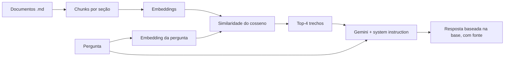

# ⚖️ Guia Cidadão — RAG com Gemini

Assistente web que responde dúvidas sobre **MEI, direitos do consumidor e documentos básicos** no Brasil, usando **RAG** (Retrieval-Augmented Generation) com a API gratuita do Google Gemini. Projeto de estudo para demonstrar **embeddings**, **busca semântica** e **prompt engineering** aplicados a um caso real.

🔗 **Demo online:** https://guia-cidadao.streamlit.app/
> ⚠️ **Aviso:** o app oferece informação geral e educativa. Não substitui advogado, contador ou órgãos oficiais. Valores e prazos mudam com o tempo.

Quem visita **não precisa de chave de API**: ela fica guardada como *secret* no servidor.

## Como funciona

1. **Chunking por seção**: cada documento é dividido em seções (`## Pergunta?`), e cada seção vira um trecho, para não misturar assuntos nem cortar ideias no meio.
2. **Embeddings**: cada trecho vira um vetor que representa seu significado.
3. **Busca semântica**: a pergunta também vira vetor; os 4 trechos mais próximos (similaridade do cosseno) são recuperados.
4. **Geração**: o Gemini recebe os trechos + a pergunta e responde *apenas* com base neles, citando a fonte e admitindo quando não encontra a informação.

## Base de conhecimento

| Arquivo | Tema | Fontes principais |
|---|---|---|
| `docs/mei.md` | MEI: limite, DAS, DASN, desenquadramento, benefícios | Portal do Empreendedor, Receita Federal (Simples Nacional), LC 123/2006 |
| `docs/consumidor.md` | CDC: arrependimento, defeitos, prazos, cobrança, como reclamar | Lei 8.078/1990, Decreto 11.034/2022, Lei 9.099/1995, consumidor.gov.br |
| `docs/documentos.md` | CIN, CPF, certidões, título, passaporte, gov.br | gov.br (Governo Digital), Receita Federal, TSE, Polícia Federal |

Os textos foram escritos com palavras próprias a partir de legislação e portais oficiais. **Última revisão: setembro de 2026.**

## Limitações e próximos passos

- [ ] Avaliação com um conjunto de perguntas de teste e respostas esperadas
- [ ] Cache dos embeddings em disco
- [ ] Mais temas (direitos do trabalhador, aluguel, INSS)
- [ ] Histórico de conversa (perguntas de acompanhamento)
- [ ] Banco vetorial (ChromaDB/FAISS) para bases maiores

## Tecnologias

Python · Streamlit · Google Gen AI SDK (`google-genai`) · NumPy
